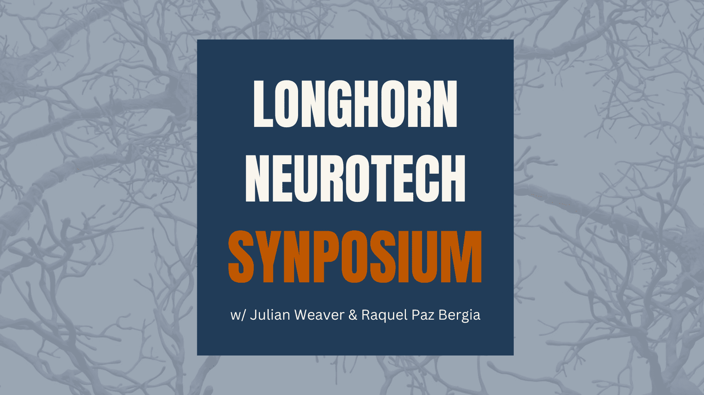

# LONGHORN NEUROTECH SYNPOSIUM

  

Discover the cutting edge of neurotechnology with The University of Texas at Austin's **Longhorn Neurotech**!  
The *Synposium* is a weekly event featuring neuroscience lectures and an interactive journal club dedicated to neurotechnology.  
Each meeting is split into two parts:
- **First 30 Minutes:** Lecture led by **Julian Weaver** (R&D Director)
- **Second 30 Minutes:** Journal club discussion led by **Raquel Paz Bergia** (Education Lead)

**Meeting Details:**
- **When:** Every Friday, 5:00 – 6:00 PM
- **Where:** RLP 1.108

---

## Table of Contents
- [LONGHORN NEUROTECH SYNPOSIUM](#longhorn-neurotech-synposium)
  - [Table of Contents](#table-of-contents)
  - [About](#about)
  - [Calendar (Spring 2025)](#calendar-spring-2025)
  - [Materials \& Resources](#materials--resources)
  - [Contributing](#contributing)
  - [License](#license)

---

## About

The Longhorn Neurotech Synposium is a weekly forum where we:
- **Lecture** on foundational neuroscience concepts and present the latest research breakthroughs in neurotechnology.
- **Discuss** current journal articles during our interactive journal club.
- **Provide** easy access to slides, recordings, and supplementary reading materials.
- **Encourage** active discussion and networking among students and professionals.

Whether you’re new to the field or a seasoned researcher, our Synposium is designed to be engaging, informative, and a hub for collaboration!

---

## Calendar (Spring 2025)

Mark your calendars for an exciting Spring semester. Below is our schedule:

| **Date**    | **Lecture Title**                                 | **Lecturer**        | **Paper**                 | **Presenter(s)**   | **Materials**                                                                                   |
|------------|-----------------------------------------------|---------------------|----------------------------|-------------------|-------------------------------------------------------------------------------------------------|
| Feb 7, 2025  | *Intro to Neuroscience*         | Julian Weaver        | *One hundred years of EEG for brain and behaviour research*     | Raquel Paz Bergia       | [Materials](./meeting_material/20250207)         |
| Feb 14, 2025 | *Electroencephalography*                 | Julian Weaver    | *Noninvasive EEG-Based Intelligent Mobile Robots: A Systematic Review*      | Donovan Santine     | [Materials](./meeting_material/20250214)         |
| Feb 21, 2025 | *Neuronal Computation & AI 1940-1980*  | Julian Weaver    | *Action prediction based on anticipatory brain potentials during simulated driving*      | Group Discussion    | [Materials](./meeting_material/20250221)         |
| Feb 28, 2025 | *Neuronal Computatoin & AI 1980-Present* | Julian Weaver    | *TBD*      | Group Discussion     | [Materials](./meeting_material/20250228)         |

| ...         | ...                                           | ...                 | ...                        | ...               | ...                                                                                             |

*Tip: Star this repository and check back weekly for updated links and session details!*

---

## Materials & Resources

All learning materials are centralized in this repository:

- **Slides:** Located in each event’s folder (e.g., `./meeting_material/20250207/slides.pdf`).
- **Recordings:** If available, found in the corresponding event folder (e.g., `./meeting_material/20250214/recording.mp4`).
- **Paper Links & Other Material:** Available as Markdown files in each event folder (e.g., `./meeting_material/20250207/links.md`).
- **Additional Resources:** Explore our [Miscellaneous Resources Directory](./misc_resources/) for supplementary readings, code snippets, datasets, and more.

---

## Contributing

We welcome contributions to ensure the Synposium continues to evolve long after the current team. For details on the recommended repository structure, guidelines for adding new materials, and best practices for maintaining the project, please see our [CONTRIBUTION.md](./CONTRIBUTION.md).

---

## License

This project is licensed under the [CC BY 4.0 License](./LICENSE).

---

*Happy learning and see you at the next session!*
